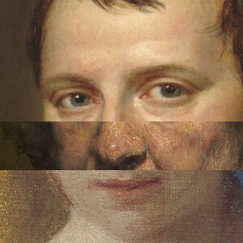
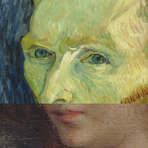
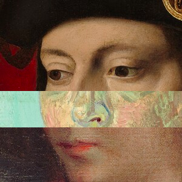

# Files for the IIIF Workshop at Coding da Vinci Ost 2018 Hackathon in Leipzig, Germany

https://codingdavinci.de/events/ost/

This notebook collects IIIF Image API resources from the [National Gallery of Art](https://www.nga.gov/) and builts two simple yet funny demo applications using IIIF resources on the fly. Beware! This project does not intend to show beautiful code. It contains some quick and dirty hacks to demonstrate IIIF features in a non-scientific way. The python code in the jupyter notebook recognizes and collects faces in the images of the National Gallery of Arts highlights collection and prepares the direct IIIF-URLs of the appropriate image regions for two sample applications:

## Use Case 1: Generate Patchwork Avatars 

[Live Demo](http://htmlpreview.github.io/?https://github.com/leanderseige/cdvost2018_iiifworkshop/blob/master/generator/index.html)

   

## Use Case 2: Memory Game

[Live Demo](http://htmlpreview.github.io/?https://github.com/leanderseige/cdvost2018_iiifworkshop/blob/master/game/game.html)

## Instructions:

Just run the jupyter notebook.

## Sources:

This distribution contains haarcascade files from the OpenCV library: https://opencv.org/ (BSD License)

This distribution contains a sample HTML/Javascript game derived from https://stackoverflow.com/questions/29329698/html5-memory-game-javascript-function by Cody Taylor (CC-BY-SA, according to Stackoverflows Terms of Service)

